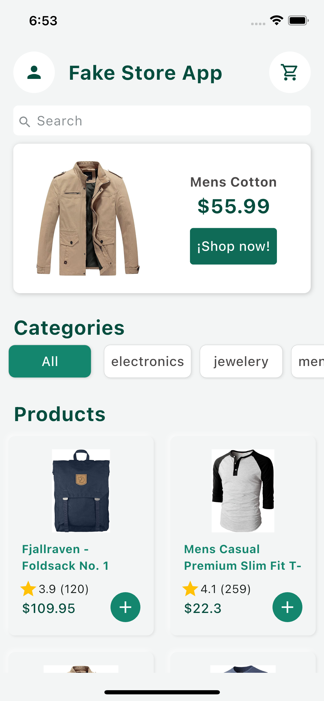
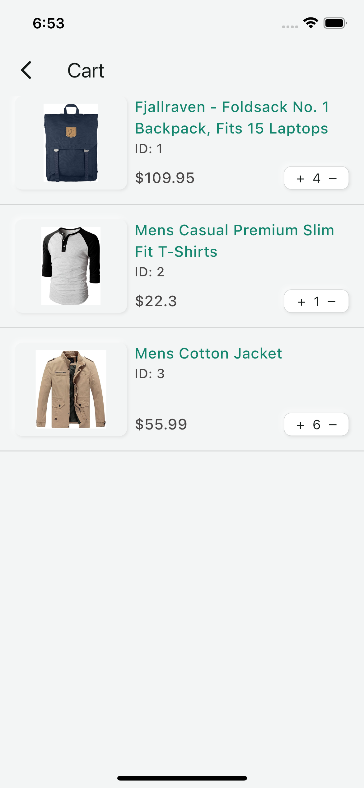
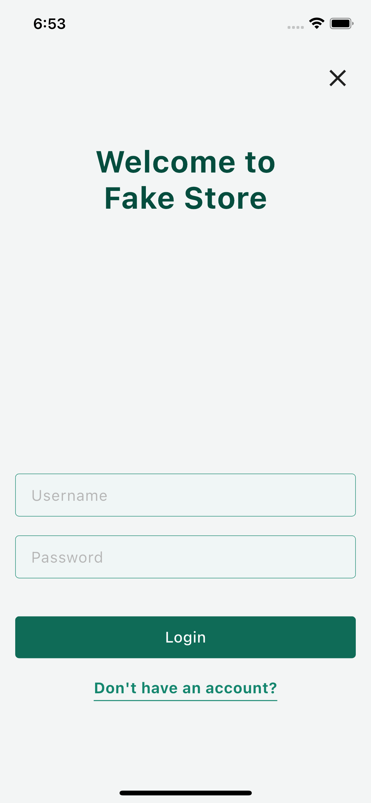
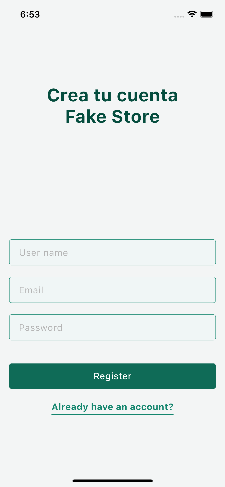

# 🛍️ FakeStore E-commerce App

Aplicación de comercio electrónico desarrollada con Flutter, que utiliza la Fake Store API para simular un entorno de tienda en línea. Permite a los usuarios explorar productos, ver detalles y gestionar su carrito de compras.

## 📋 Tabla de Contenidos

- [🛍️ FakeStore E-commerce App](#️-fakestore-e-commerce-app)
  - [📋 Tabla de Contenidos](#-tabla-de-contenidos)
  - [✨ Características](#-características)
  - [🛠️ Tecnologías Utilizadas](#️-tecnologías-utilizadas)
  - [📁 Estructura del Proyecto](#-estructura-del-proyecto)
  - [🚀 Instalación y Ejecución](#-instalación-y-ejecución)
  - [📸 Pantallas](#-pantallas)
    - [Lista de Productos:](#lista-de-productos)
    - [Detalle de un producto:](#detalle-de-un-producto)
    - [Carrito de comprar:](#carrito-de-comprar)
    - [Autenticación:](#autenticación)
    - [Registro:](#registro)
  - [📄 Licencia](#-licencia)

## ✨ Características

- **Listado de Productos**: Muestra una lista de productos obtenidos desde la Fake Store API.
- **Detalles del Producto**: Visualiza información detallada de cada producto seleccionado.
- **Carrito de Compras**: Permite agregar productos al carrito y gestionar su contenido.
- **Interfaz Responsiva**: Diseño adaptado para diferentes tamaños de pantalla y plataformas.

## 🛠️ Tecnologías Utilizadas

- **[Flutter](https://flutter.dev/)**: Framework de UI para desarrollar aplicaciones nativas multiplataforma.
- **[Dart](https://dart.dev/)**: Lenguaje de programación utilizado por Flutter.
- **[Fake Store Package](https://github.com/Carl0395/fake_store_package/)**: Paquete de Flutter que permite interactuar con la [Fake Store API](https://fakestoreapi.com/) que proporciona datos ficticios de productos para pruebas y desarrollo.
- **[Ecommerce_system_design](https://github.com/Carl0395/ecommerce_system_design)**: Paquete con un sistema de diseño para aplicaciones de comercio electrónico.

## 📁 Estructura del Proyecto

```
fakestore-ecommerce-app/
├── lib/
├── core/                         # Inyección de dependencia, rutas.
├── features/
│   ├── account/                  # Gestión cuenta de usuario
│   │   ├── domain/               # Casos de uso
│   │   └── presentation/         # Widgets, páginas, controladores
│   ├── cart/                     # Lógica del carrito de compras
│   │   ├── domain/
│   │   └── presentation/
│   ├── products/                 # Lógica de productos (catálogo, detalles)
│   │   ├── domain/
│   │   └── presentation/
│   └── shared/                   # Componentes compartidos entre features
│       ├── domain/
│       └── presentation/
└── main.dart                     # Punto de entrada de la app
```

## 🚀 Instalación y Ejecución

Sigue los siguientes pasos para clonar y ejecutar el proyecto en tu entorno local:

1. **Clonar el repositorio**

   ```bash
   git clone https://github.com/Carl0395/fakestore-ecommerce-app.git
   cd fakestore-ecommerce-app
   ```

2. **Instalar dependencias**

   Asegúrate de tener Flutter instalado. Luego, ejecuta:

   ```bash
   flutter pub get
   ```

3. Ejecuta el comando

   ```dart
   dart run build_runner watch -d
   ```
   Para la generación de código de Riverpod
   
4. **Ejecutar la aplicación**

   Para ejecutar la aplicación en un dispositivo o emulador conectado:

   ```bash
   flutter run
   ```

## 📸 Pantallas

### Lista de Productos:



Muestra la lista de productos

### Detalle de un producto:


Muestra el detalle de un producto

### Carrito de comprar:



Permite ver el carrito de compras

### Autenticación:



Permite autenticar un usuario

### Registro:



Permite crear una cuenta de usuario

## 📄 Licencia

Este proyecto está bajo la licencia MIT. Consulta el archivo [LICENSE](LICENSE) para más detalles.
